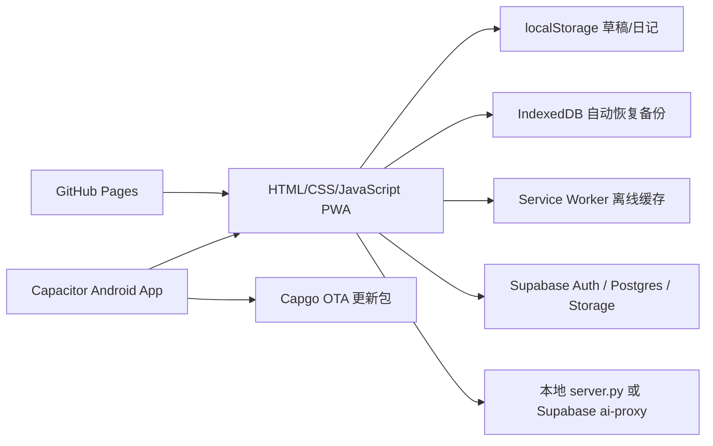

# 岁笺交叉验收与交付报告（2026-08-21）

## 结论

本轮四角色交叉验收已完成。本地代码达到**个人稳定使用的本地优先日记**基线；在执行 Supabase schema 迁移并完成真实设备升级验证前，**附件/待办跨端同步和 Android 更新不作为已交付能力**。公开发布还需要正式 Android 签名策略、真实账号全链验证和发布前回归。

## 架构与服务事实



- 前端：`index.html`、`styles.css`、`app.js`；页面状态保存在浏览器，数据以本地优先方式写入。
- 云端：Supabase Auth、`journal_entries`、`daily_summaries`、`period_summaries`、`journal_tasks` 与私有 Storage 桶；访问依赖 RLS（行级安全）。
- AI：本机调试由 `server.py` 同源代理；已登录的线上/原生壳由 Edge Function `ai-proxy` 代理。
- 发布：GitHub Actions 构建 `dist-mobile/` 并发布 Pages；Capacitor 生成 Android APK，Capgo 下载校验后的网页 OTA。

## 功能完成度

| 功能 | 当前状态 | 证据 | 阻塞/前置条件 | 等级 |
|---|---|---|---|---|
| 日记、草稿、编辑、删除、搜索、标签/心情、备份导入导出 | 已验证本机主流程 | 浏览器走查；`npm test` | 跨设备需登录 | 个人稳定使用 |
| AI 整理与区间汇总 | 已验证真实 API 调用与“确认替换” | 本机 DeepSeek Flash 实测；页面保留原文 | 线上需登录且 Edge Function 已配置 | 个人稳定使用 |
| 离线 PWA 与移动端布局 | 已验证 | 390px、320px 浏览器验证；UI 回归测试 | `file://` 不属于 Service Worker 场景 | 个人稳定使用 |
| 登录、会话、自动同步、冲突副本 | 代码与回归验证完成 | 数据完整性回归；会话策略文档 | 需真实 Supabase 账号验证 | 小范围试用前验证 |
| 附件、标签/心情、待办跨端同步 | 前端已就绪，云端未迁移 | schema 探针曾报 `attachments` 缺列、`journal_tasks`/bucket 缺失 | 执行 `supabase/schema.sql` | 未交付 |
| Android 网页 OTA | 代码、包结构和启动顺序已验证 | OTA/原生更新回归测试 | 需真机从旧版升级 | 小范围试用前验证 |
| Android 原生 APK 更新 | 版本已升至 `1.1.2 / code 4` | `npm run build:android` 成功；清单 SHA 一致 | 需确认签名延续与真机覆盖安装 | 小范围试用前验证 |

## 已修复问题

| 优先级 | 问题、根因与影响 | 修复 | 验证 |
|---|---|---|---|
| P1 | 同 ID 导入只跳过，较新备份无法覆盖旧本机日记 | 以 `updatedAt` 合并较新的 live 记录，保留较新本机或 tombstone | `tests/data-integrity-regression.mjs` |
| P1 | 删除再恢复日记会创建同 `sourceKey` 待办，触发数据库唯一键冲突 | 任务使用稳定槽位；恢复时复用原 task ID，清理旧重复项 | 数据完整性回归覆盖恢复与唯一性 |
| P1 | 旧 Android 版本不会发现同版本 APK 中的新 OTA 逻辑 | 原生版本升至 `code 4 / v1.1.2`，更新清单随构建生成 | 原生包/清单测试、Android 构建 |
| P1 | 详情页无删除入口；导入无法被键盘聚焦 | 详情新增删除按钮；导入改为 `button` 触发隐藏文件输入 | UI 可访问性回归、浏览器 Tab 验证 |
| P1 | 320px 页面溢出，Google Fonts 被 CSP 拦截 | 修正响应式宽度，改为系统字体 | 320px 视觉验证、控制台零错误 |
| P2 | 发布脚本变更可绕过 Android 版本递增 | Actions guard 覆盖 `android/`、构建脚本、Capacitor、依赖和 `scripts/` | `tests/release-guard-regression.mjs` |

## 待完成的外部动作与回滚

### P0：Supabase schema 迁移

**复现**：匿名只读探针曾返回 `journal_entries.attachments` 列不存在、`journal_tasks` 不存在、`journal-attachments` Storage 桶不存在。
**影响**：附件、标签/心情字段及待办跨端同步回退为文本兼容模式。
**执行**：在 Supabase SQL Editor 先创建 `audit_backup` 快照表，再运行 [`../supabase/schema.sql`](../supabase/schema.sql)。
**验证**：确认 `attachments` 列、`journal_tasks` 表、`journal-attachments` 私有桶存在；用两个同账号设备完成新增、附件、删除、离线恢复同步。
**回滚**：停止新版本发布；使用迁移前 `audit_backup.*_20260821` 表恢复记录。Storage 物理文件需在迁移前单独下载备份（当前桶为空时无此项）。

### P1：Android 真机升级

**执行**：先检查旧 APK 与新 APK 的签名证书一致，再在 Android 真机从 `v1.1.1` 覆盖安装 `v1.1.2`；打开 App 验证自动 OTA、网络中断、回到前台和手动检查安装包。
**回滚**：保留上一版 APK 和 Pages 的上一个成功部署；若网页 OTA 异常，回退 `app-update.json` 到上一校验通过的 bundle。

## 发布门槛

- **自己稳定使用**：本地功能已达标；建议每次重要记录后导出 JSON/ZIP 备份。
- **少量用户试用**：先完成 schema 迁移、真实注册/登录/同步、两台设备冲突和 Android 升级验证。
- **公开发布**：在上述基础上，使用长期保存且受控的正式签名身份，新增 PR CI 预检、监控/错误收集、Storage 垃圾清理策略与隐私说明。

## 本次验证命令

```bash
npm run check
npm test
npm run build:android
git diff --check
```

以上命令均在本轮本地变更上通过；真机、真实账号与迁移后的 RLS 属于尚待执行的外部验证。
